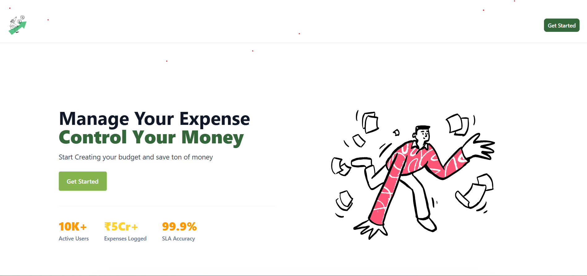
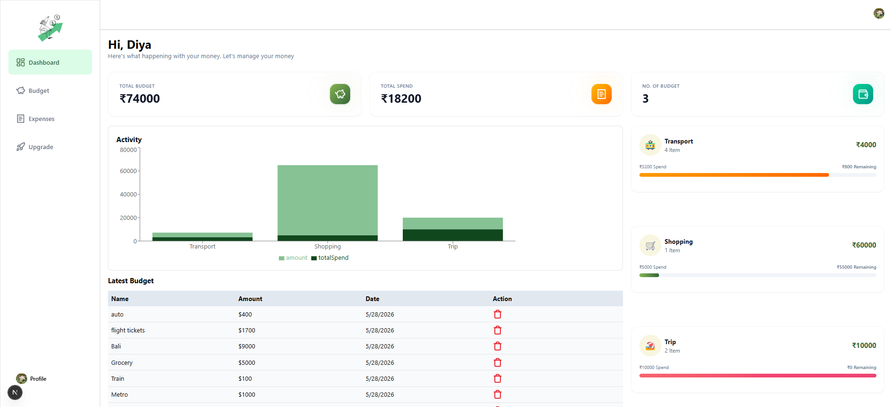

<p align="center">
  
</p>

<h1 align="center">FinTrack — Personal Finance Manager</h1>

<p align="center">
  <strong>Track expenses, create budgets, and take control of your money — all in one place.</strong>
</p>

<p align="center">
  <a href="#features">Features</a> •
  <a href="#tech-stack">Tech Stack</a> •
  <a href="#architecture">Architecture</a> •
  <a href="#getting-started">Getting Started</a> •
  <a href="#screenshots">Screenshots</a> •
  <a href="#roadmap">Roadmap</a>
</p>

<p align="center">
  
  
  
  
  
  
</p>

---

<!-- Live Demo Link: deployed -->
> 🔗 **Live Demo:** [fintrack-app.vercel.app](https://fin-track-neon-beta.vercel.app/)

## ✨ Features

| Feature | Description |
|---|---|
| **📊 Interactive Dashboard** | Real-time overview of total budgets, total spend, remaining balance, and active budget count with animated stat cards |
| **💰 Budget Management** | Create, edit, and delete budgets with custom emoji icons and spending limits |
| **📝 Expense Tracking** | Log individual expenses under budgets with timestamps; view, filter, and delete entries |
| **📈 Visual Analytics** | Recharts-powered bar charts showing budget vs. actual spend for each category |
| **🔐 Secure Authentication** | Clerk-powered sign-in/sign-up with social logins and session management |
| **⚠️ Over-Budget Warnings** | Real-time toast notifications when spending exceeds budget thresholds |
| **🎨 Polished UI/UX** | Professional landing page with animated stats strip, gradient accents, hover micro-animations, and responsive layout |
| **🚀 Upgrade Page (Layout)** | Pre-built premium upgrade page layout for future monetization features |

## 🛠️ Tech Stack

### Frontend
- **Framework:** [Next.js 16](https://nextjs.org/) (App Router, Turbopack)
- **UI Library:** [React 19](https://react.dev/)
- **Styling:** [Tailwind CSS 4](https://tailwindcss.com/)
- **Component Library:** [shadcn/ui](https://ui.shadcn.com/) with custom theming
- **Charts:** [Recharts](https://recharts.org/)
- **Icons:** [Lucide React](https://lucide.dev/) + [Ant Design Icons](https://ant.design/components/icon)
- **Notifications:** [Sonner](https://sonner.emilkowal.dev/) (toast system)

### Backend & Data
- **ORM:** [Drizzle ORM](https://orm.drizzle.team/) (type-safe, lightweight)
- **Database:** [Neon](https://neon.tech/) (serverless PostgreSQL)
- **Auth:** [Clerk](https://clerk.com/) (session management, social login, protected routes)

### Dev Tooling
- **Bundler:** Turbopack (via Next.js 16)
- **Linting:** ESLint with Next.js config
- **DB Tooling:** Drizzle Kit (`db:push`, `db:studio`)

## 🏗️ Architecture

```
fin-track/
├── app/
│   ├── (auth)/                  # Auth routes (sign-in, sign-up)
│   │   ├── sign-in/
│   │   └── sign-up/
│   ├── (routes)/
│   │   └── dashboard/           # Protected dashboard routes
│   │       ├── _components/     # Dashboard-specific components
│   │       │   ├── BarChartDashboard.jsx
│   │       │   ├── CardsInfo.jsx
│   │       │   ├── DashboardHeader.jsx
│   │       │   └── SideNav.jsx
│   │       ├── budgets/         # Budget CRUD
│   │       │   └── _components/
│   │       ├── expenses/        # Expense management
│   │       │   ├── [id]/        # Dynamic expense routes
│   │       │   └── _components/
│   │       └── upgrade/         # Future premium features
│   ├── _components/             # Landing page components
│   │   ├── Header.jsx
│   │   ├── Hero.jsx
│   │   └── Footer.jsx
│   ├── globals.css
│   ├── layout.js                # Root layout (Clerk, fonts, toaster)
│   └── page.js                  # Landing page
├── components/ui/               # shadcn/ui primitives
├── utils/
│   ├── dbConfig.jsx             # Neon database connection
│   └── schema.js                # Drizzle schema (Budgets, Expenses)
├── drizzle.config.js            # Drizzle Kit configuration
└── public/                      # Static assets (logo, illustrations)
```

### Database Schema

```
┌──────────────────┐        ┌──────────────────┐
│     Budgets      │        │     Expenses     │
├──────────────────┤        ├──────────────────┤
│ id (PK, serial)  │◄───┐   │ id (PK, serial)  │
│ name (varchar)   │    │   │ name (varchar)   │
│ amount (varchar) │    └───│ budgetId (FK)    │
│ icon (varchar)   │        │ amount (numeric) │
│ createdBy (varchar)│      │ createdAt (varchar)│
└──────────────────┘        └──────────────────┘
```

## 🚀 Getting Started

### Prerequisites

- **Node.js** ≥ 18.x
- **npm** ≥ 9.x
- A [Neon](https://neon.tech) PostgreSQL database
- A [Clerk](https://clerk.com) application (for authentication)

### 1. Clone the repository

```bash
git clone https://github.com/SrinjaniRoyChowdhury/FinTrack-Manage-your-Expenses.git
cd FinTrack-Manage-your-Expenses
```

### 2. Install dependencies

```bash
npm install
```

### 3. Set up environment variables

Create a `.env` file in the root directory:

```env
NEXT_PUBLIC_CLERK_PUBLISHABLE_KEY=pk_test_...
CLERK_SECRET_KEY=sk_test_...

NEXT_PUBLIC_CLERK_SIGN_IN_URL=/sign-in
NEXT_PUBLIC_CLERK_SIGN_UP_URL=/sign-up

NEXT_PUBLIC_DATABASE_URL=postgresql://...@ep-xxx.us-east-2.aws.neon.tech/neondb?sslmode=require
```

### 4. Push the database schema

```bash
npm run db:push
```

### 5. Run the development server

```bash
npm run dev
```

Open [http://localhost:3000](http://localhost:3000) to view the app.

### Optional: Inspect your database

```bash
npm run db:studio
```

## 📸 Screenshots

| Landing Page | Dashboard |
|---|---|
|  |  |

## 🗺️ Roadmap

- [x] Budget CRUD with emoji icons
- [x] Expense tracking with per-budget categorization
- [x] Interactive bar chart analytics
- [x] Clerk authentication (email + social login)
- [x] Over-budget toast warnings
- [x] Responsive design across all breakpoints
- [ ] Dark mode toggle
- [ ] Export expenses to CSV/PDF
- [ ] Recurring expenses & subscriptions
- [ ] Monthly spending trends (line charts)
- [ ] Premium tier with advanced analytics

## 🤝 Contributing

This is a personal project, but suggestions and feedback are welcome! Feel free to [open an issue](https://github.com/SrinjaniRoyChowdhury/FinTrack-Manage-your-Expenses/issues) or submit a pull request.

## 📄 License

This project is open-source and available under the [MIT License](LICENSE).

---

<p align="center">
  Built with ❤️ by <a href="https://github.com/SrinjaniRoyChowdhury">Srinjani Roy Chowdhury</a>
</p>